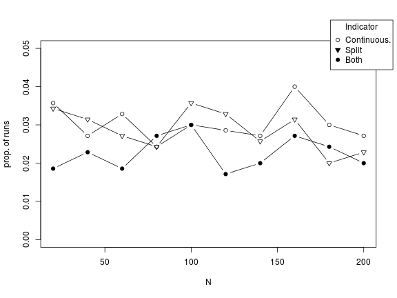

```
## Loading required package: stringr
```

```
## Loading required package: mnormt
```


Simulation for Significance of splitting (Jan. 2014)
========================================================

Based on Jamie's notes
[go to pdf ](https://www.dropbox.com/s/jtw5z4uyrxj5rcg/Notes%202012-12-21.pdf)


## Setup
### Model
Two continuous latent variables (\(\eta\) and \(\xi\) ) are created with <b>N</b> cases, sharing a correlation equal to \(\rho\). A measure \(x\) of \(\xi\) is created with reliability \(rel\), and then  is dichotomized accordingly to \(p\) \(1-p\) into \(c\). The correlations \( r_pe=r(\eta,x) \)  and \( r_pb=r(\eta,c) \) are computed, their p-value and significance (at .05) is recorded.
### Design

_N_={20, 40, 60, 80, 100, 120, 140, 160, 180, 200}
<br>
_rho_={0}
<br>
_rel_={0.3, 0.4, 0.5, 0.6, 0.7, 0.8, 0.9}

each combination of _N_ and _rho_ is repeated 100 times.


#### Proportions of samples where both correlations are significant (_both_), only the .biserial (_Split_), and only the Pearson (_continuos_) by reliability 


 


#### Proportion of significant results by N broken down by indicator type


 


#### Mean abs distance between Pearson correlation and \(\rho\) results by reliability broken down by indicator significance

<i>in this case mean distance=effect size in terms of r</i>

 


#### Mean abs distance between .biserial correlation and \(\rho\) results by reliability broken down by indicator significance

<i>in this case mean distance=effect size in terms of r</i>

 


############## not null hypothesis #############

### Design

_N_={20, 40, 60, 80, 100, 120, 140, 160, 180, 200}
<br>
_rho_={0.5}
<br>
_rel_={0.3, 0.4, 0.5, 0.6, 0.7, 0.8, 0.9}

each combination of _N_ and _rho_ is repeated 100 times.


#### Proportions of samples where both correlations are significant (_both_), only the .biserial (_Split_), and only the Pearson (_continuos_) by reliability 


 


#### Proportion of significant results by N broken down by which indicator is significant


 


#### Mean abs distance between Pearson correlation and \(\rho\) results by reliability broken down by indicator significance


 


#### Mean abs distance between .biserial correlation and \(\rho\) results by reliability broken down by indicator significance


 


Proportions of samples when each of the correlation is significant


```
  Group.1 Group.2 Group.3    x
1       0       0     0.0 6430
2       1       0     0.0  212
3       0       1     0.0  200
4       1       1     0.0  158
5       0       0     0.5 1798
6       1       0     0.5  966
7       0       1     0.5  150
8       1       1     0.5 4086
```

```
  conti.sig split.sig rho freq     prop
1         0         0 0.0 6430 0.229643
2         1         0 0.0  212 0.007571
3         0         1 0.0  200 0.007143
4         1         1 0.0  158 0.005643
5         0         0 0.5 1798 0.064214
6         1         0 0.5  966 0.034500
7         0         1 0.5  150 0.005357
8         1         1 0.5 4086 0.145929
```

```
  conti.sig split.sig rho freq     prop
2         1         0   0  212 0.007571
4         1         1   0  158 0.005643
```

```
  conti.sig split.sig rho freq   prop
6         1         0 0.5  966 0.0345
8         1         1 0.5 4086 0.1459
```


